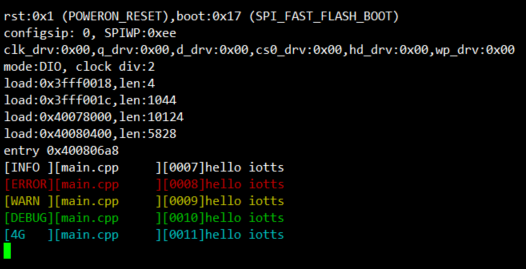

# IOLOG
### 效果



### 使用示例

```c
#include "iolog.h"

void setup() {
  // put your setup code here, to run once:
  Serial.begin(115200);
}

void loop() {
  // put your main code here, to run repeatedly:
  logi("Hello IOTTS");  
  logi("Hello IOTTS");  
  logw("Hello IOTTS"); 
  loge("Hello IOTTS"); 
  logd("Hello IOTTS"); 
  log4g("Hello IOTTS");
}
```

